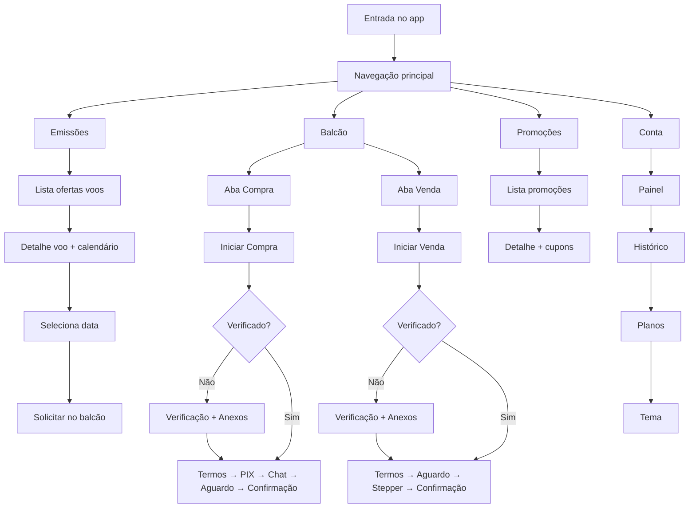
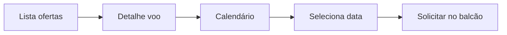
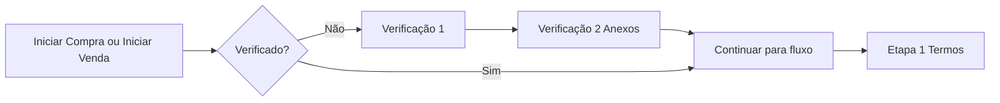
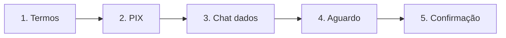
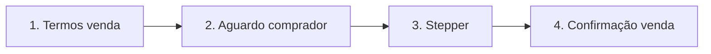

# Fluxos, design system e verificação pós-acção comprar/vender

## 1. Reposicionamento da verificação (após clicar em comprar milhas ou vender)

**Estado atual:** A verificação (verificação fácil + anexo de documentos) é um gate antes de entrar no app ([Verificacao.jsx](c:\Users\Renato\Documents\Cursor\balcao\src\pages\Verificacao.jsx), [App.jsx](c:\Users\Renato\Documents\Cursor\balcao\src\App.jsx)).

**Alteração desejada:** A verificação só é exigida **depois** de o utilizador **clicar em comprar milhas ou vender** — ou seja, ao acionar **"Iniciar Compra"** ou **"Iniciar Venda"** no Balcão. Não está ligada à seleção de data (Emissões).

**Fluxo proposto:**

- Entrada no app: sem verificação; o utilizador acede diretamente aos quatro módulos (Emissões, Balcão, Promoções, Conta).
- **Emissões:** Lista de ofertas → toque num card → **Tela de detalhes do voo** (informação expandida + calendário).
- Na tela de detalhes: o utilizador escolhe um dia no calendário (data selecionada).
- **Balcão — ao clicar em comprar/vender:** se ainda não estiver verificado, abrir o **fluxo de verificação** (passo 1: verificação rápida; passo 2: anexo de documentos). Concluída a verificação, permitir continuar (ex. botão “Solicitar no balcão” ou equivalente).
- Persistir “utilizador verificado” (ex. `localStorage` ou estado global) para não repetir a verificação nas próximas vezes.
- **Balcão (Iniciar Compra / Iniciar Venda):** Conforme a doc, pode não envolver calendário; opção: exigir verificação na primeira vez que entra num fluxo de compra/venda (se ainda não verificou), ou apenas após data em Emissões. O plano assume que a **verificação é obrigatória apenas ao clicar em Iniciar Compra ou Iniciar Venda (Balcão)**; em Balcão pode reutilizar o mesmo estado “já verificado”.

**Ficheiros a alterar:**

- [App.jsx](c:\Users\Renato\Documents\Cursor\balcao\src\App.jsx): remover o gate “se não verificado → mostrar Verificacao”; sempre mostrar o app (Emissões/Balcão/Promoções/Conta).
- [AppContext.jsx](c:\Users\Renato\Documents\Cursor\balcao\src\context\AppContext.jsx): manter `verified` e `completeVerification`; usar `verified` para decidir se, no clique em Iniciar Compra/Iniciar Venda, se mostra o fluxo de verificação ou a ação seguinte.
- Nova tela (ou passo dentro do fluxo): **Detalhe do voo** com calendário (RF-EMI-04). Ao selecionar data: se `!verified` → abrir modal ou tela de Verificação; após concluir → `completeVerification()` e seguir para “Solicitar no balcão” / próximo passo.
- [Verificacao.jsx](c:\Users\Renato\Documents\Cursor\balcao\src\pages\Verificacao.jsx): reutilizável como tela/modal “em linha” no fluxo (invocada ao clicar em comprar milhas ou vender (Balcão)), em vez de tela de entrada.

---

## 2. Design system (estender cores atuais)

Base: paleta atual em [src/styles/variables.css](c:\Users\Renato\Documents\Cursor\balcao\src\styles\variables.css) (Figma: primary `#0f77ff`, primary-dark `#094899`, accent `#f6bd00`, neutros).

**2.1 Tokens a adicionar (semânticos e estados)**

- **Sucesso:** verde (ex. `--color-success`, `--color-success-bg`).
- **Aviso:** amarelo/laranja (ex. `--color-warning`, `--color-warning-bg`).
- **Erro:** vermelho (ex. `--color-error`, `--color-error-bg`).
- **Info:** azul claro (ex. `--color-info`, `--color-info-bg`) — pode derivar do primary.
- **Estados de controlo:** foco, desabilitado, hover (derivados dos existentes ou novas variáveis).
- **Superfícies:** manter e, se necessário, `--color-bg-elevated`, `--color-bg-overlay` para modais.

**2.2 Tipografia**

- Escala de tamanhos (ex. `--text-xs` a `--text-xl`) e pesos (--font-regular, --font-medium, --font-semibold).
- Manter `--font-family` (Schibsted Grotesk) e definir variantes para títulos, corpo, legendas e labels.

**2.3 Espaçamento e layout**

- Escala de espaçamento (--space-1 a --space-6 ou 8) para padding/margin consistente.
- Manter `--radius-card`, `--radius-pill`, `--radius-btn` e adicionar, se necessário, `--radius-modal`.

**2.4 Componentes (documentação / implementação)**

- Botão primário, secundário, outline, desabilitado (usando os novos tokens).
- Cards (emissão, balcão, promoção) já existentes; alinhar a variáveis do design system.
- Inputs, checkboxes, pills de filtro, stepper vertical (fluxo de venda), chips de estado.
- Modal ou tela de verificação reutilizável.

**Entrega:** Um ficheiro (ou pasta) de design tokens que estenda [variables.css](c:\Users\Renato\Documents\Cursor\balcao\src\styles\variables.css) e, opcionalmente, um doc em `docs/` (ex. `design-system.md`) com paleta, tipografia, espaçamento e uso dos componentes.

---

## 3. Fluxos conforme a documentação

Referência: [docs/Especificacao-Tecnica-Milhas-Balcao.md](c:\Users\Renato\Documents\Cursor\balcao\docs\Especificacao-Tecnica-Milhas-Balcao.md).

**3.1 Emissões (RF-EMI-01 a RF-EMI-04)**

- Lista de ofertas (cards com imagem, trecho, companhia, preço/milhas).
- Filtros (Companhias, datas, “Filtros”) e, se aplicável, fontes de dados (RF-EMI-03) em rodapé.
- Ao tocar num card → **Detalhe do voo** (informação expandida + calendário interativo).
- Calendário: dias disponíveis visíveis; utilizador **seleciona uma data**.
- **(sem verificação aqui):** utilizador pode → fluxo Verificação (2 passos); depois “Solicitar no balcão” ou equivalente.
- Mock de ofertas (e opcionalmente RF-EMI-02 com fallback para mock).

**3.2 Balcão — Compra (RF-BAL-01, RF-BAL-02, sec. 4.1)**

- Aba “Compra”: lista de ofertas de vendedores; ação “Iniciar Compra”.
- Ao iniciar compra: **Etapa 1** — Aceite dos termos (checkbox obrigatório); **Etapa 2** — PIX simulado (QR + copia e cola, código único RN-PAY-01, botão confirmar pagamento); **Etapa 3** — Instrução de envio de dados no chat + botão “Continuar”; **Etapa 4** — Aguardo da emissão; **Conclusão** — Resumo da compra.
- Estado do fluxo persistente (RN-NAV-01): ao sair para chat e voltar, retomar na etapa correta.

**3.3 Balcão — Venda (RF-BAL-01, RF-BAL-02, sec. 4.2)**

- Aba “Venda”: lista de pedidos de compradores; ação “Iniciar Venda”.
- **Etapa 1** — Aceite dos termos de venda; **Etapa 2** — Aguardo do comprador (oferta listada); **Etapa 3** — Stepper vertical (Análise de Segurança, Confirmação de Pagamento, obter dados no chat, checkbox “Confirmar a emissão da passagem”); **Conclusão** — Resumo da venda.

**3.4 Balcão — Filtros, lista/grade, contraproposta (RF-BAL-03, RF-BAL-04, RF-BAL-05)**

- Filtros e ordenação na lista do Balcão.
- Alternância lista vs. grade.
- Tela/modal de contraproposta com validação em tempo real (RN-OFF-01: valor não pode ser > 15% inferior ao original).

**3.5 Promoções (RF-PRO-01 a RF-PRO-03)**

- Lista de cards (imagem, título, categoria, validade).
- Detalhe com conteúdo estruturado (parágrafos, listas, notas, cupons).
- Cupons com “copiar” e feedback visual.

**3.6 Conta (RF-ACC-01 a RF-ACC-04)**

- Painel com nome, avatar, plano.
- Links: Histórico de vendas (lista + detalhe por transação), Planos de assinatura (slider horizontal “magnético”), Configurações (tema claro/escuro).

---

## 4. Fluxogramas (utilizador, telas, lógica)

**4.1 Visão geral do utilizador (alto nível)**

**4.2 Fluxo Emissões (sem verificação)**

**4.2b Verificação ao comprar ou vender (Balcão)**

**4.3 Fluxo Compra (etapas)**

**4.4 Fluxo Venda (etapas)**

**4.5 Mapa de telas (resumo)**

| Área      | Telas / Passos                                                                                                                                                                                  |
| --------- | ----------------------------------------------------------------------------------------------------------------------------------------------------------------------------------------------- |
| App       | Bottom nav; módulo ativo (Emissões / Balcão / Promoções / Conta).                                                                                                                               |
| Emissões  | Lista ofertas; Detalhe voo (calendário); seleção de data; Solicitar no balcão (sem verificação).                                                                                                |
| Balcão    | Abas Compra/Venda; Lista ofertas; ao clicar Iniciar Compra/Venda → Verificação (se não verificado) → Termos; PIX (Compra); Chat; Aguardo; Stepper (Venda); Contraproposta (modal); Confirmação. |
| Promoções | Lista; Detalhe (conteúdo + cupons).                                                                                                                                                             |
| Conta     | Painel; Histórico vendas; Detalhe transação; Planos assinatura; Configurações (tema).                                                                                                           |

**Persistência (RN-NAV-01):** Estado do fluxo de compra/venda (etapa atual, dados da transação) em contexto/estado global (e opcionalmente sessionStorage) para retomar após ir ao chat e voltar.

---

## 5. Ordem sugerida de implementação

1. **Design system:** Estender [variables.css](c:\Users\Renato\Documents\Cursor\balcao\src\styles\variables.css) com tokens de estado (success, warning, error, info, disabled, focus) e opcionalmente tipografia/espaçamento; doc em `docs/design-system.md`.
2. **Remover gate de verificação na entrada:** Ajustar [App.jsx](c:\Users\Renato\Documents\Cursor\balcao\src\App.jsx) e [AppContext.jsx](c:\Users\Renato\Documents\Cursor\balcao\src\context\AppContext.jsx); app sempre acessível.
3. **Emissões — Detalhe + calendário:** Nova tela/página Detalhe do voo com calendário; ao selecionar data, checar `verified`; se não, abrir Verificação (tela ou modal); após concluir, permitir “Solicitar no balcão”.
4. **Balcão — Fluxos Compra e Venda:** Implementar etapas em sequência (termos, PIX, chat, aguardo, stepper na venda) com estado persistente e mocks.
5. **Balcão — Contraproposta:** Modal/tela com validação RN-OFF-01.
6. **Promoções — Detalhe e cupons:** Conteúdo estruturado e botão copiar com feedback.
7. **Conta — Histórico, Planos, Tema:** Completar subsecções e slider de planos.

---

## 6. Ficheiros principais a criar ou alterar

- **Design system:** [src/styles/variables.css](c:\Users\Renato\Documents\Cursor\balcao\src\styles\variables.css) (estender); opcional `docs/design-system.md`.
- **Verificação após comprar/vender:** [App.jsx](c:\Users\Renato\Documents\Cursor\balcao\src\App.jsx) (remover gate inicial), [AppContext.jsx](c:\Users\Renato\Documents\Cursor\balcao\src\context\AppContext.jsx), [Balcao.jsx](c:\Users\Renato\Documents\Cursor\balcao\src\pages\Balcao.jsx) (ao clicar Iniciar Compra / Iniciar Venda, checar `verified` e mostrar [Verificacao.jsx](c:\Users\Renato\Documents\Cursor\balcao\src\pages\Verificacao.jsx) antes do fluxo).
- **Emissões:** Nova tela Detalhe do voo com calendário (ex. `src/pages/DetalheVoo.jsx`), sem verificação.
- **Fluxos Balcão:** Novas telas/componentes por etapa (Termos, PIX, Chat, Aguardo, Stepper, Confirmação) e estado de fluxo (ex. contexto ou store).
- **Promoções/Conta:** Detalhe de promoção com cupons; histórico e planos em Conta.
- **Documentação:** Em `docs/`, ficheiro com fluxogramas (ou referência a este plano) e mapa de telas.

